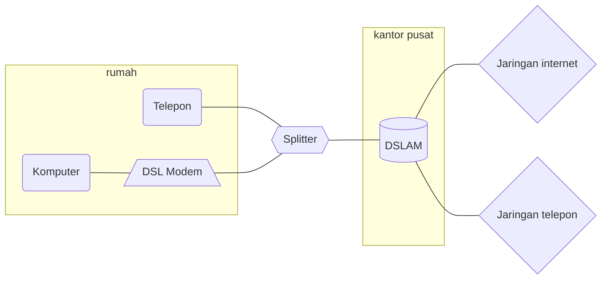
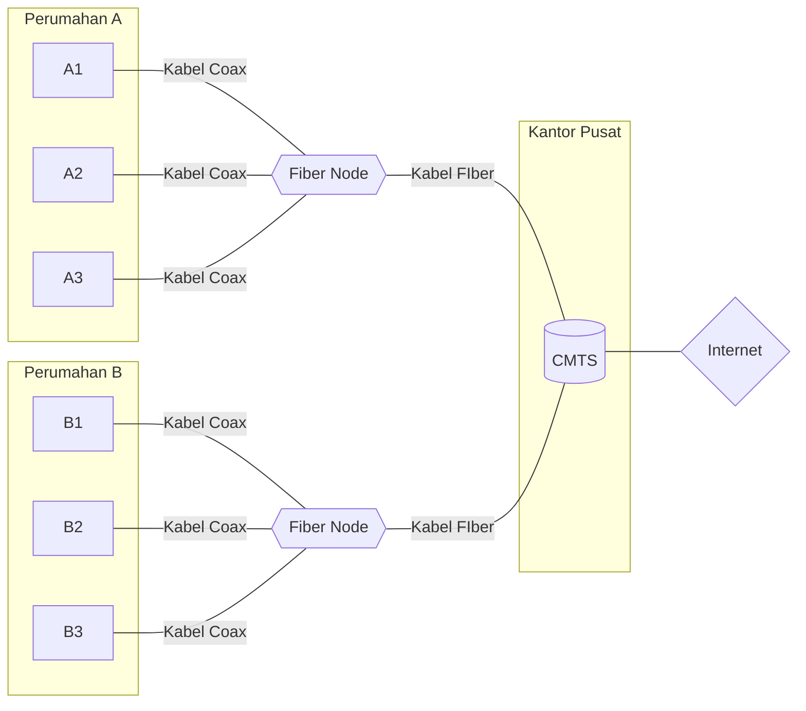
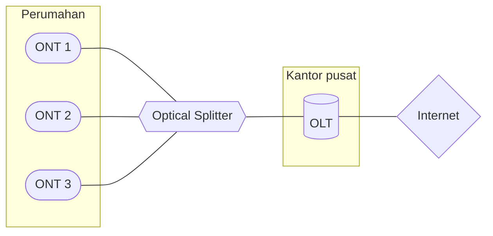
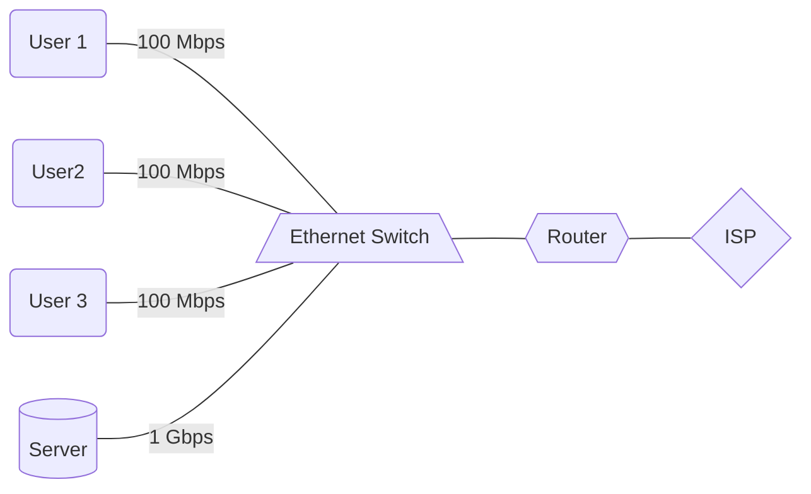
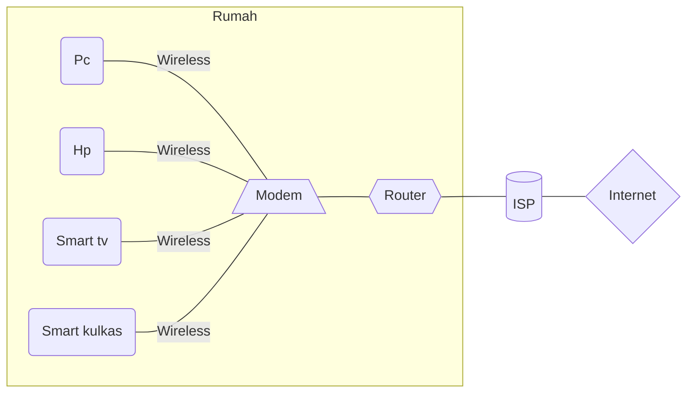
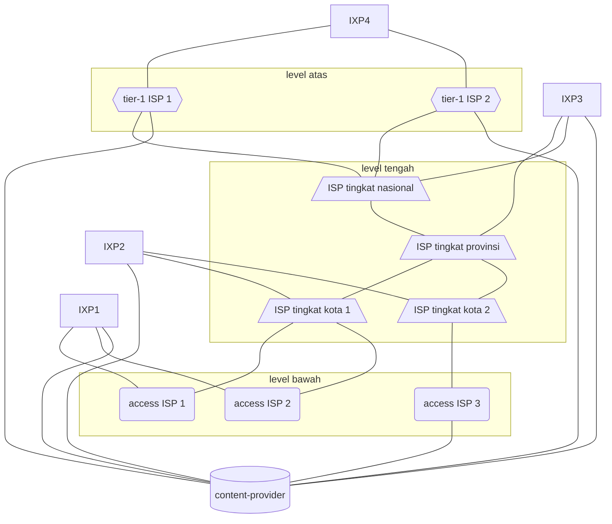

> **Judul	: Computer Networking, A Top-Down Approach**
>
> **Penulis : James F. Kurose, Keith W. Ross**
> 
> **Penerbit : PEARSON**
> 
> **Jumlah Halaman : +- 856 halaman**
> 
> **Genre : Computer Network**
> 
> ***Start : 25, Februari 2021***
> 
> ***Finish : -***

---

# Daftar isi :

- [Daftar isi :](#daftar-isi-)
- [Chapter 1 : Computer Networks and the Internet](#chapter-1--computer-networks-and-the-internet)
	- [1.1 : What is the Internet?](#11--what-is-the-internet)
		- [1.1.1 : A Nuts-and-Bolts Description](#111--a-nuts-and-bolts-description)
		- [1.1.2 : A Services Description](#112--a-services-description)
		- [1.1.3 : What is a Protocol?](#113--what-is-a-protocol)
	- [1.2 : The Network Edge](#12--the-network-edge)
		- [1.2.1 : Access Networks](#121--access-networks)
			- [Home Access : DSL, Cable, FTTH, Dial-up, Satellite](#home-access--dsl-cable-ftth-dial-up-satellite)
				- [Digital Subscriber Line (DSL)](#digital-subscriber-line-dsl)
				- [Cable Internet](#cable-internet)
				- [Fiber To The Home (FTTH)](#fiber-to-the-home-ftth)
				- [Satellite link](#satellite-link)
				- [Dial-up](#dial-up)
				- [5G Fixed Wireless](#5g-fixed-wireless)
			- [Access in the Enterprise (and the Home): Ethernet and WiFi](#access-in-the-enterprise-and-the-home-ethernet-and-wifi)
			- [Wide-Area Wireless Access: 3G and LTE 4G and 5G](#wide-area-wireless-access-3g-and-lte-4g-and-5g)
		- [1.2.2 : Physical Media](#122--physical-media)
			- [Twisted-Pair Copper Wire](#twisted-pair-copper-wire)
			- [Coaxical Cable](#coaxical-cable)
			- [Fiber Optics](#fiber-optics)
			- [Terrestrial Radio Channels](#terrestrial-radio-channels)
			- [Satellite Radio Channles](#satellite-radio-channles)
	- [1.3 : The Network Core](#13--the-network-core)
		- [1.3.1 : Packet Switching](#131--packet-switching)
			- [Store-and-Forward Transmission](#store-and-forward-transmission)
			- [Queuing Delays and Packet Loss](#queuing-delays-and-packet-loss)
			- [Forwarding Tables and Routing Protocols](#forwarding-tables-and-routing-protocols)
		- [1.3.2 : Circuit Switching](#132--circuit-switching)
			- [Multiplexing in Circuit-Switched Networks](#multiplexing-in-circuit-switched-networks)
			- [Packet Switching Versus Circuit Switching](#packet-switching-versus-circuit-switching)
		- [1.3.3 : A Network of Networks](#133--a-network-of-networks)
			- [Network Structure 1](#network-structure-1)
			- [Network Structure 2](#network-structure-2)
			- [Network Structure 3](#network-structure-3)
			- [Network Structure 4](#network-structure-4)
			- [Network Structure 5](#network-structure-5)
	- [1.4 : Delay, Loss, and Throughput in Packet-Switched Networks](#14--delay-loss-and-throughput-in-packet-switched-networks)
		- [1.4.1 : Overview of Delay in Packet-Switched Networks](#141--overview-of-delay-in-packet-switched-networks)
			- [Types of Delay](#types-of-delay)
			- [Processing Delay](#processing-delay)
			- [Queuing Delay](#queuing-delay)
			- [Transmission Delay](#transmission-delay)
			- [Propagation Delay](#propagation-delay)
			- [Comparing Transmission and Propagation Delay](#comparing-transmission-and-propagation-delay)
		- [1.4.2 : Queuing Delay and Packet Loss](#142--queuing-delay-and-packet-loss)
			- [Packet Loss](#packet-loss)
		- [1.4.3 : End-to-End Delay](#143--end-to-end-delay)
			- [Traceroute](#traceroute)
			- [End System Application, and Other Delays](#end-system-application-and-other-delays)
		- [1.4.4 : Throughput in Computer Networks](#144--throughput-in-computer-networks)
	- [1.5 : Protocol Layers and Their Service Models](#15--protocol-layers-and-their-service-models)
		- [1.5.1 : Layered Architecture](#151--layered-architecture)
			- [Protocol Layering](#protocol-layering)
			- [Application Layer](#application-layer)
			- [Transport Layer](#transport-layer)
			- [Network Layer](#network-layer)
			- [Link Layer](#link-layer)
			- [Physiscal Layer](#physiscal-layer)
		- [1.5.2 : Encapsulation](#152--encapsulation)
	- [1.6 : Networks Under Attack](#16--networks-under-attack)
		- [Hal-hal yang mungkin dilakukan oleh penjahat cyber di dalam internet :](#hal-hal-yang-mungkin-dilakukan-oleh-penjahat-cyber-di-dalam-internet-)
			- [The Bad Guys Can Put Malware into Your Host Via the Internet](#the-bad-guys-can-put-malware-into-your-host-via-the-internet)
			- [The Bad Guys Can Attack Servers and Network Infrastructure](#the-bad-guys-can-attack-servers-and-network-infrastructure)
			- [The Bad Guys Can Sniff Packets](#the-bad-guys-can-sniff-packets)
			- [The Bad Guys Can Masquerade as Someone You Trust](#the-bad-guys-can-masquerade-as-someone-you-trust)
	- [1.7 : History of Computer Networking and the Internet](#17--history-of-computer-networking-and-the-internet)
		- [1.7.1 : The Development of Packet Switching: 1961–1972](#171--the-development-of-packet-switching-19611972)
		- [1.7.2 : Proprietary Networks and Internetworking: 1972–1980](#172--proprietary-networks-and-internetworking-19721980)
		- [1.7.3 : A Proliferation of Networks: 1980–1990](#173--a-proliferation-of-networks-19801990)
		- [1.7.4 : The Internet Explosion: The 1990s](#174--the-internet-explosion-the-1990s)
		- [1.7.5 : The New Millennium](#175--the-new-millennium)

---

# Chapter 1 : Computer Networks and the Internet

## 1.1 : What is the Internet?

### 1.1.1 : A Nuts-and-Bolts Description

- **Internet** adalah jaringan komputer yang saling menghubungkan banyak (milyaran) perangkat di seluruh dunia.

- Setiap perangkat disebut **host** atau **end system.**

- Setiap perangkat terhubung melalui **communication link** dan **packet switch**.

- **Packet switch** berfungsi untuk meneruskan informasi yang datang menuju **communication link** selanjutnya.

- **Router** dan **link-layer switch** adalah 2 contoh **packet switch** yang paling banyak digunakan saat ini.

- Informasi yang dikirimkan perangkat berupa pecahan-pecahan kecil dari data awal yang disebut **packet**.

- **Packet** yang dikirimkan dari satu perangkat ke perangkat lain akan melewati serangkaian **communication link** dan **packet switch** yang disebut **route / path**.

- **Packet** akan dirakit ulang menjadi data aslinya ketika sudah sampai di perangkat tujuannya.

- Akses internet disediakan oleh **Internet Service Provider (ISP).**

- Protokol mengatur bagaimana prosedur pengiriman dan penerimaan informasi didalam internet.

- **Transmission Control Protocol (TCP)** dan **Internet Protocol (IP)** adalah 2 protokol paling penting di dalam internet.

- **Internet Standards** mengatur tentang fungsi dari masing-masing protokol.

### 1.1.2 : A Services Description

- **Internet** juga bisa didefinisikan sebagai infrastruktur yang menyediakan layanan untuk aplikasi.

- Aplikasi yang berjalan di setiap perangkat dapat bertukar informasi dengan aplikasi lain (perangkat lain) melalui internet.

- **Socket Interface** mengatur bagaimana aplikasi dapat bertukar informasi dengan aplikasi lain.

### 1.1.3 : What is a Protocol?

- Dalam analogi manusia, protokol dapat berupa **tata cara 2 orang / lebih saling berkomunikasi.**
	
	Contohnya :
	> A : "Selamat pagi, Bob"

	> B : "Selamat pagi, Alice"

	> A : "Bolehkah aku melihat PR Matematikamu?"

	> B : "Tentu saja. Ini dia"
	
	Alice memulai komunikasi dengan menyapa Bob, kemudian Bob menyapa balik. Baru setelahnya Alice menyatakan tujuannya dalam berkomunikasi (melihat PR Matematika Bob) yang kemudian direspon oleh Bob (memberi PR Matematika miliknya kepada Alice).

- Di dalam internet, proses yang sama berlaku dan dilakukan oleh **2 perangkat atau lebih yang saling bertukar informasi / data.**

- Pertukaran informasi / data hanya bisa terjadi apabila kedua belah pihak **menjalankan protokol yang sama.**

- Setiap aktivitas di dalam internet yang melibatkan komunikasi antara 2 perangkat atau lebih **diatur oleh protokol.**

## 1.2 : The Network Edge

- Sebuah perangkat atau **end system** juga disebut sebagai **host**, karena menjalankan suatu aplikasi atau program (web server, email server, web browser, dll).

### 1.2.1 : Access Networks

- **Access network** adalah jaringan komputer yang menghubungkan antara sebuah perangkat dengan **router** pertama.

#### Home Access : DSL, Cable, FTTH, Dial-up, Satellite

##### Digital Subscriber Line (DSL)
- Akses internet menggunakan jaringan telepon lokal.

- Akses internet dan telepon terhubung melalui kabel tembaga.

- Data digital yang dikirimkan oleh pengguna akan diubah menjadi data analog, kemudian akan diubah kembali menjadi data digital ketika tiba di kantor pusat.

- **Splitter** berfungsi untuk *membagi jalur komunikasi menjadi 3 frekuensi berbeda* sehingga data internet dan telepon dapat *dikirimkan secara bersamaan*.
  
  - 50 kHz - 1 MHz : downstream channel
  - 4 kHz - 50 kHz : Upstream channel
  - 0 kHz - 4 kHz  : channel telepon.

- **Digital Subscriber Line Access Multiplexer** yang terletak di kantor pusat berfungsi untuk mengubah kembali data analog menjadi data digital, dan untuk memisahkan antara data internet dan data telepon.

- Kecepatan yang ditawarkan ada yang D:24 Mbps & U:3.5 Mbps, dan D:52 Mbps & U:16 Mbps.

- Akses internet **asymmetric** karena kecepatan **download** dan **upload** yang berbeda.

- Layanan ini hanya tersedia untuk rumah-rumah yang berjarak 8-16 Km selebihnya harus mencari alternatif lain.

Contoh graph jaringan **DSL** :

##### Cable Internet
- Akses internet menggunakan jaringan kabel televisi.

- Menggunakan kabel fiber dari kantor pusat yang kemudian akan dibagi-bagi menjadi kabel coaxial yang terhubung ke rumah-rumah.

- Karena menggunakan gabungan kabel coaxial dan fiber disebut juga **Hybrid Fiber Coax (HFC).**

- Data digital yang dikirimkan akan diubah menjadi data analog, yang akan diubah kembali menjadi data digital di kantor pusat oleh **Cable Modem Termination System (CMTS).**

- Data dikirimkan melalui 2 channel :
  - Upstream 		: pengguna --> kantor pusat
  - Downsetream : kantor pusat --> pengguna.

- Akses internet **asymmetric**, kecepatan **download** dan **upload** berbeda.

- Kecepatan D:40 Mbps & U:30 Mbps, D:1.2 Gbps & U:100 Mbps.

Contoh graph jaringan **Cable Internet** :

##### Fiber To The Home (FTTH)
- Akses internet menggunakan kabel fiber dari kantor pusat langsung ke rumah-rumah.

- Kabel dari kantor pusat ketika sudah dekat dengan perumahan akan dibagi-bagi untuk setiap rumah.

- Ada 2 arsitektur dalam pembagian kabel fiber **Active Optical Network (AON)** dan **Passive Optical Network (PON).**

- Menyediakan kecepatan hingga **gigabits per second**, rata-rata **20 Mbps.**

- Cenderung lebih mahal.

- Dalam arsitektur **PON** :
  - Setiap rumah memiliki **Optical Network Terminator (ONT)** yang terhubung dengan **optical splitter.**
  - **Optical splitter** menggabungkan kabel fiber dari beberapa rumah menjadi 1 kabel fiber menuju kantor pusat.
  - Di kantor pusat terdapat **Optical Line Terminator** yang menghubungkan ke jaringan internet.
  - Setiap data yang dikirim oleh **OLT** akan direplikasi di **splitter.**

Contoh graph arsitektur **PON** :

##### Satellite link
- Dapat menjangkau area yang tidak bisa menggunakan akses **DSL**, **Cable**, dan **FTTH.**

- Belum begitu banyak penyedia layanan ini.

- Kecepatan rata-rata 1 Mbps.

##### Dial-up
- Alternatif akses internet melalui jaringan telepon.

- **Kecepatan sangat lambat** kurang lebih 56 kbps.

##### 5G Fixed Wireless
- Sinyal dipancarkan secara **wireless** dari kantor pusat dan diterima oleh modem yang ada di rumah, kemudian **WiFi router** (biasanya sepaket dengan modem) bisa digunakan untuk memberikan akses internet di area rumah secara **wireless.**

- Teknologi terbaru.

- Kecepatan sangat tinggi.

#### Access in the Enterprise (and the Home): Ethernet and WiFi
- Banyak perusahaan, kampus, dan bahkan rumah yang memanfaatkan **Local Area Network (LAN)** untuk mendapatkan akses internet.

- **Ethernet** adalah teknologi yang paling populer.

- Kecepatan mencapai 100 Mbps - puluhan Gbps untuk pengguna, dan mencapai 1 Gbps - 10 Gbps untuk server.

Contoh graph internet akses melalui **Ethernet** :

- Sekarang kebanyakan orang mengakses internet secara *Wireless* atau tanpa kabel dengan memanfaatkan teknologi **IEEE 802.11** atau lebih familiarnya **WiFi**.

- **WiFi** dapat diakses dari jarak puluhan meter, mampu memberikan kecepatan hingga 100 Mbps, dan tersedia di mana-mana.

Contoh graph **WiFi** di rumah :

#### Wide-Area Wireless Access: 3G and LTE 4G and 5G
- Digunakan oleh perangkat seluler (Hp) untuk mengakses internet.

- Menggunakan sinyal radio yang dipancarkan oleh tower telekomunikasi yang dikendalikan oleh penyedia layanan.

- Mampu menjangkau hingga puluhan kilometer.

### 1.2.2 : Physical Media

- Setiap data yang dikirimkan akan melewati serangkaian **transmitter** dan **receiver.**

- Data dikirim dengan memancarkan gelombang elektromagnet atau denyut optik (1 denyut = 1 bit) melalui perantara fisik.

- Perantara fisik ini tidak harus sama dalam setiap **route** yang dilewati data.

- Ada 2 kategori :
  - **Guided media** : melalui media yang solid (kabel fiber, kabel tembaga).
  - **Unguided media** : melalui udara / atmosfer (WiFi, 3G, LTE).

#### Twisted-Pair Copper Wire
- Media yang paling umum digunakan dan biaya paling murah.
  
- Terdiri dari 2 kabel tembaga dengan ketebalan 1 mm yang dipilin menjadi bentuk spiral (untuk mengurangi gangguan elektrik).

- Banyak digunakan di jaringan telepon.

- Kecepatan hingga 10 Mbps - 10 Gbps.

- Kecepatan bergantung pada ketebalan kabel dan jarak antara **transmitter** dan **receiver.**

#### Coaxical Cable
- Terdiri dari 2 konduktor tembaga yang disusun secara *konsentris*.

- Banyak digunakan di jaringan televisi kabel.

- Kecepatan hingga ratusan Mbps.

#### Fiber Optics
- Media ramping dan fleksibel yang menghasilkan denyut cahaya untuk mengirimkan data (1 denyut = 1 bit).

- Tahan terhadap gangguan elektromagnet, memiliki rasio pelemahan sinyal rendah, dan sangat sulit untuk dibajak.

- Kecepatan hingga ratusan Gbps.

- Digunakan sebagai tulang punggung jaringan internet.

#### Terrestrial Radio Channels
- Menggunakan gelombang elektromagnet.

- Tidak memerlukan kabel sama sekali, mampu menembus benda-benda yang menghalangi, dan mampu menjangkau jarak yang jauh.

- Kekuatan sinyal sangat bergantung pada kondisi area penyebaran sinyal (terdapat objek penghalang, gangguan dari gelombang elektromagnet lain).

- Dibagi menjadi 3 kategori :
  - **Short distance** (1-2 meter) : bluetooth, mouse wireless, dll
  - **Local area** (puluhan meter) : WiFi
  - **Wide area** (puluhan kilometer) : 3G, LTE.

#### Satellite Radio Channles
- Menghubungkan **transmitter / receiver** dari bumi (**ground station**) dengan satelit.

- Satelit menerima sinyal dari 1 frekuensi, menghasilkan sinyal dengan **repeater**, dan mengirimkan sinyal dalam frekuensi berbeda.

- Ada 2 tipe satelit :
  - **Geostationary** : tempatnya permanen (tidak berubah)
  - **Low-Earth Orbitting (LEO)** : tempatnya lebih rendah dari **geostationary** dan berpindah-pindah (mengorbit seperti bulan).

## 1.3 : The Network Core

### 1.3.1 : Packet Switching

- Dalam sebuah jaringan setiap **end system** saling bertukar data / informasi satu dengan yang lain, data tersebut bisa berupa foto / gambar (jpeg), audio (mp3), email, dll.

- Data yang dikirimkan akan dibagi-bagi menjadi pecahan-pecahan data yang disebut **packet** yang dalam perjalanannya akan melewati serangkaian **communication link** dan **packet switch.**

- Setiap **packet** akan dikirimkan dengan kecepatan yang sebanding dengan kecepatan maksimal dari setiap **communication link**.
Misalnya *L* bits data dikirimkan melalui **communication link** dengan kecepatan *R* bits/second, maka packet akan diterima dalam waktu *L/R* seconds.

#### Store-and-Forward Transmission
- Kebanyakan **packet switch** menggunakan **store-and-forward transmission** dalam proses pengiriman data.

- **Store-and-forward transmission** mengharuskan setiap **packet switch** harus menerima seluruh data sebelum data tersebut bisa diteruskan ke **communication link** selanjutnya. **Packet switch** harus menyimpan (**buffer**) terlebih dahulu data yang diterima (sampai seluruh data diterima).

#### Queuing Delays and Packet Loss
- Setiap **packet switch** tersambung dengan banyak **communication link** yang masing-masingnya terdapat **output buffer / queue** untuk menyimpan data yang diterima sebelum diteruskan ke **communication link** tersebut.

- Jika ternyata **communication link** sedang sibuk atau sedang mengirimkan data lain, maka data yang akan dikirimkan melalui **communication link** tersebut harus menunggu di **output buffer.** Waktu penundaan ini bervariasi dan bergantung pada tingkat kemacetan di dalam jaringan.

- Jika sebuah **output buffer** penuh dan pada saat yang bersamaan terdapat data yang datang, maka akan terjadi **packet loss** yang mana data yang baru datang atau data yang sudah ada sebelumnya akan dibuang.

#### Forwarding Tables and Routing Protocols
- Di dalam internet setiap **end system** memiliki sebuah alamat yang disebut **IP address.**

- Proses pengiriman data memanfaatkan **IP address** ini untuk mengirimkan data dari satu **packet switch** ke **packet switch** lain, persis seperti *surat pos.*

- Agar bisa meneruskan data ke **end system** tujuannya, setiap **packet switch** dibekali dengan semacam daftar / tabel berisikan alamat-alamat dari **communication link** yang terhubung dengannya, tabel ini disebut **forwarding table.**

- Jadi setiap data tiba di **packet switch,** alamat tujuan data tersebut akan diperiksa dan dicocokkan dengan **forwarding table** yang tersedia untuk menentukan rute tercepat.

- Setiap **forwarding table** yang tersedia di **packet switch** telah diatur secara otomatis menggunakan **routing protocol.**

### 1.3.2 : Circuit Switching

- Ada 2 cara yang bisa digunakan untuk mengirimkan data melalui serangkaian **communication link** :
  - **Circuit switching**
  - **Packet switching**

- Di dalam **circuit switching** setiap komponen yang diperlukan untuk komunikasi antara 2 **end system** akan *dialokasikan secara khusus* selama proses komunikasi berlangsung.

- Berbeda dengan **packet switching**, setiap komponen *dialokasikan sesuai dengan permintaan* / ketika sedang dibutuhkan saja. 

- Karena setiap komponen dialokasikan secara khusus, maka **circuit switching** menjamin kecepatan transmisi yang stabil / konstan.

- Banyak digunakan oleh jaringan telepon.

#### Multiplexing in Circuit-Switched Networks
- Ada 2 cara pembagian / pengalokasian :
  - **Frequency-Division Multiplexing (FDM)**
  - **Time-Division Multiplexing (TDM)**

- **FDM** membagi-bagi frekuensi dengan lebar (bandwith) tertentu (umumnya 4 kHz).

- **TDM** membagi-bagi waktu menjadi beberapa *frame* (durasi sama setiap frame) yang setiap framenya terdiri dari beberapa *slot* (setiap frame memiliki jumlah slot yang sama). Setiap koneksi akan dialokasikan 1 slot setiap frame waktu.

#### Packet Switching Versus Circuit Switching
- **Circuit switching** dinilai boros karena ketika **end system** sedang tidak berkomunikasi / mengirim data maka sumber daya yang telah dialokasikan tidak dapat digunakan oleh **end system lain** yang membutuhkan.

- **Circuit switching** juga sangat rumit untuk diimplementasikan dan membutuhkan biaya yang sangat mahal.

- **Packet switching** dinilai tidak cocok digunakan untuk layanan *real-time* seperti panggilan telepon, *video conference* karena kemungkinan *delay* yang tidak pasti.

- Meski punya kelebihan dan kekurangan masing-masing, **packet switching** dinilai lebih unggul karena *memberikan performa yang sama dengan **circuit switching** dan dapat mengakomodasi pengguna 3 kali lebih banyak.*

### 1.3.3 : A Network of Networks

- Internet terbentuk dari adanya *jaringan dari jaringan komputer* yang sangat besar dan rumit.

#### Network Structure 1
- Terdiri dari beberapa **access ISP** dan satu **global ISP**.

- **Access ISP** terhubung dengan **global ISP** untuk mendapatkan akses internet.

- Karena diperlukan biaya yang sangat mahal untuk membangun jaringan, **global ISP** menarik biaya pada **access ISP.**

- Pihak **access ISP** disebut sebagai **customer** karena menyambung kepada pihak **global ISP** yang menyediakan layanan (**provider**).

#### Network Structure 2
- Memiliki beberapa **global ISP** yang tersambung satu sama lain dan saling bersaing.

- Membentuk 2 level hierarki, dengan **global ISP** berada di level atas, dan **access ISP** berada di level bawah.

#### Network Structure 3
- Tidak semua kota / daerah terdapat **ISP.**

- **ISP** di suatu wilayah (kota / provinsi /negara) disebut dengan **regional ISP** terakhir akan tersambung dengan **tier-1 ISP**.
Contohnya : **ISP** di tingkat kota akan tersambung dengan **ISP** di tingkat provinsi, kemudian tersambung dengan **ISP** tingkat nasional, terakhir tersambung dengan **tier-1 ISP.**

- Membentuk 3 level hierarki, dengan **tier-1 ISP** berada di level paling atas, kemudian **regional ISP** berada di level tengah, **access ISP** berada di level bawah.

- Setiap level dalam hierarki akan membentuk hubungan *pelanggan-pembeli* di mana **ISP** di level yang lebih rendah akan membayar kepada **ISP** di level yang lebih tinggi (kecuali **tier-1** karena berada pada level paling atas).

#### Network Structure 4
- Adanya **Points of Presence (PoP), multi-homing, peering,** dan **Internet Exchange Point (IXP).**

- **Pop** adalah sekumpulan **router** yang terdapat di suatu wilayah yang disediakan oleh **provider ISP** untuk **customer ISP** agar bisa terhubung.

- **Multi-homing** adalah ketika satu **ISP** (kecuali **tier-1**) terhubung dengan beberapa **provider ISP** sekaligus (**regional** ataupun **tier-1**).
Keuntungannya adalah masih bisa terhubung dengan internet meskipun salah satu **provider** sedang *offline.*

- **Peering** adalah ketika beberapa **ISP** dalam level hierarki yang sama saling terhubung. Tujuannya untuk mengurangi biaya yang harus dibayar ke **provider ISP**. **Peering** dilakukan dengan kesepakatan bersama.

- **IXP** adalah suatu lokasi dimana beberapa **ISP** bisa melakukan **peering.**

#### Network Structure 5
- Model yang paling tepat menggambarkan jaringan internet saat ini.

- Adanya **content-provider networks** (contohnya *Google*).

- **Content-provider** ini biasanya memiliki jaringan privat tersendiri.

- **Content-provider** terhubung dengan berbagai **ISP** dari beberapa level (**tier-1, regional, access ISP**). Mereka bisa terhubung langsung dengan **access ISP** dengan melakukan **peering**.

contoh graph ilustrasi Network Structure 5 :

## 1.4 : Delay, Loss, and Throughput in Packet-Switched Networks

### 1.4.1 : Overview of Delay in Packet-Switched Networks

- Ketika suatu data dikirimkan oleh **end system** menuju **end system** lain, data ini akan melewati serangkaian **router**, ketika dalam perjalanan data tersebut akan mengalami berbagai macam **delay** di setiap router yang dilewatinya.

- Macam-macam **delay** :
  - **Nodal processing delay**
  - **Queuing delay**
  - **Transmission delay**
  - **Propagation delay**
	Total dari keseluruhan delay di atas dinamakan **total nodal delay.**

- Peforma suatu aplikasi berbasis internet akan sangat terpengaruhi oleh **delay** tersebut.

#### Types of Delay
- Setiap data yang akan dikirimkan dari **router A** menuju **router B** akan dicek terlebih dahulu alamat tujuannya untuk menentukan **link** (tercepat) yang bisa ditempuh.

- Setiap **link** akan didahului dengan **queue / buffer**. Ketika data akan ditransfer melalui **link** ini dan ternyata **router** sedang mengirimkan data lain, data tersebut harus menunggu di **buffer**.

- Data hanya bisa dikirimkan apabila **router** sedang tidak mengirimkan data, dan tidak ada data lain yang sedang menunggu di **buffer.**

#### Processing Delay
- Waktu yang dibutuhkan untuk mengecek alamat tujuan data dan menentukan **link** / rute (tercepat) mana yang harus ditempuh.

- Kisaran mikro detik.

#### Queuing Delay
- Disebabkan ketika data harus menunggu di **buffer** sebelum bisa dikirimkan oleh **router.**

- Kisaran mikro detik hingga mili detik.

#### Transmission Delay
- Waktu yang dibutuhkan untuk mengirimkan semua bagian dari data menuju **link** yang sudah ditentukan.

- Misalnya data dengan ukuran *L bits*, kecepatan transfer *R bits/second*, maka **transmission delay**nya adalah *L/R*.

- Kisaran mikro detik hingga mili detik

#### Propagation Delay
- Waktu yang dibutuhkan data untuk menempuh jalur / rute dari **router** pengirimnya menuju **router** tujuan.

- Kecepatan transfer dipengaruhi oleh media fisik yang dilalui oleh data tersebut.

- Kisaran $2*10^8 m/s - 3*10^8 m/s$ (mendekati kecepatan cahaya).

#### Comparing Transmission and Propagation Delay
- **Transmission delay** :
  - Waktu yang dibutuhkan untuk mengirim setiap bagian dari data keluar dari **router A** menuju **router B.**
  - $f$ dari besarnya data dan kecepatan transfer.

- **Propagation delay** :
  - Waktu yang dibutuhkan data untuk sampai menuju **router B** setelah keluar dari **router A.**
  - $f$ dari jarak yang ditempuh oleh data.

- $D_{nodal} = D_{proc} + D_{queue} + D_{trans} + D_{prop}$
	*\*) Pengaruh dari delay-delay ini sangat bervariasi*

### 1.4.2 : Queuing Delay and Packet Loss

- Jenis **delay** yang paling menarik adalah **queuing delay** karena sangat bervariasi dan tidak memiliki pola yang pasti (*random*).

- Dampak signifikan dari **queuing delay** bergantung pada rasio datangnya data, kecepatan transfer, dan bagaimana data tersebut datang (bergilirian atau bersamaan).

- **Traffic intensity** adalah rasio *La/R* dimana *L* adalah besarnya data (*bits*), *a* adalah rata-rata banyak data yang datang per detik, dan R adalah kecepatan transfer (*bits/sec*).

- Ketika rasio *La/R* > 1, maka rata-rata data yang datang *melebihi* rata-rata data yang bisa ditransfer. Dampaknya adalah **buffer** akan terus terisi tanpa batasan (sampai tak terhingga).

- Prinsip penting dalam mendesain suatu jaringan adalah *jangan sampai **traffic intensity** melebihi 1.*

- **Traffic intensity** berbanding lurus dengan rata-rata **queuing delay** yang terjadi.

- Perubahan sedikit pada **traffic intensity** dapat berdampak besar pada **queuing delay** yang terjadi.

#### Packet Loss
- Ketika **buffer** penuh dan ada data yang tiba dalam waktu bersamaan akan terjadi yang namanya **packet loss**, data akan hilang karena tidak tersedia tempat untuk menyimpannya.

- **Packet loss** terjadi karena kapasitas **buffer** yang terbatas.

### 1.4.3 : End-to-End Delay

- $D_{end-end} = N(D_{proc}+D_{queue}+D_{trans}+_{Dprop})$
  *\*) Data melewati N-1 **router** dalam perjalanannya*

#### Traceroute
- Metode yang digunakan untuk mengukur **delay** yang terjadi dalam proses pengiriman data dari A ke B.

- Semisal ada *N-1* **router** yang dilewati data dalam perjalanannya, maka A akan mengirimkan *N* data spesial untuk tiap-tiap **router** (router *n* mendapatkan data bernomor *n*, B / tujuan mendapat data bernomor *N*). Data spesial ini akan mengirimkan kembali informasi kepada pengirimnya (A) ketika sudah mencapai **router**.

- Informasi yang dikirimkan oleh data spesial ini adalah :
  - Nama **router**
  - Alamat **router**
  - Waktu **delay** yang dialami oleh data

#### End System Application, and Other Delays
- Selain yang sudah disebutkan, juga ada jenis **delay** lain yang berdampak signifikan pada proses pengiriman data.

- Contohnya : **media packetization delay.**

### 1.4.4 : Throughput in Computer Networks

- **Instatenous throughput** adalah kecepatan penerimaan data (*bits/sec*) di **end system** tujuan.

- **Average throughput** adalah rata-rata kecepatan penerimaan data. Semisal ada data berukuran *F* bits diterima dalam waktu *T* detik, maka **average throughput**nya adalah *F/T*.

- Besarnya **throughput** adalah mendekati (tidak mutlak) besarnya kecepatan transfer **link** yang paling kecil (*bottleneck link*). Semisal data dikirimkan melalui 2 **link** dengan kecepatan 1 Mb/s dan 2 Mb/s, maka **throuhput**nya adalah 1 Mb/s.

- Besar kecilnya **throughput** bergantung pada :
  - Kecepatan transfer oleh **link** yang dilewati data
  - **Intervening traffic**

- Biasanya faktor yang paling mempengaruhi besar kecilnya **thoughput** adalah **access network.**

## 1.5 : Protocol Layers and Their Service Models

### 1.5.1 : Layered Architecture

- Contoh dalam kehidupan sehari-hari adalah *perjalanan menggunakan pesawat*.

- Ada beberapa tahapan / lapisan yang harus dilewati selama kita melakukan perjalanan menggunakan pesawat.
Lapisan-lapisan tersebut contohnya :
	- Bandara keberangkatan :
    	- Lapisan tiket (beli tiket)
    	- Lapisan muatan (check-in)
    	- Lapisan gerbang (masuk pesawat)
    	- Lapisan landasan (takeoff)
	- Dalam perjalanan / di udara :
    	- Lapisan perjalanan (pesawat terbang menuju tujuan)
	- Bandara kedatangan :
    	- Lapisan landasan (landing)
    	- Lapisan gerbang (keluar pesawat / masuk terminal)
    	- Lapisan muatan (ambil koper / barang bawaan)
    	- Lapisan tiket (komplain apabila perlayanan tidak memuaskan)

- Setiap lapisan dengan lapisan dibawahnya melakukan semacam pekerjaan / layanan tertentu.
Layanan tersebut dilakukan dengan :
	- Melakukan pekerjaan khusus dalam lapisan tersebut
  - Menggunakan layanan yang disediakan oleh lapisan yang tepat dibawahnya

- Setiap orang baru bisa menuju ke lapisan setelahnya apabila telah menyelesaikan / melewati lapisan sebelumnya.

- Arsitektur semacam ini menyediakan *modularitas* sehingga mudah untuk mengubah / memperbarui *cara kerja* (**tanpa mengubah pekerjaan yang dilakukan**) suatu komponen tanpa menimbulkan masalah pada komponen lain.

- Untuk sebuah sistem yang sangat rumit dan selalu diperbarui secara berkala, penerapan arsitektur lapisan memberikan manfaat yang krusial.

#### Protocol Layering
- Di dalam arsitektur internet, setiap protokol terletak dalam suatu lapisan tertentu.

- Lapisan di dalam arsitektur internet :
  - Lapisan aplikasi :
  - Lapisan transport
  - Lapisan network
  - Lapisan link
  - Lapisan physical

- Setiap protokol dapat diimplementasikan di **hardware,** atau **software,** atau kombinasi keduanya.
  - Protokol-lapisan-aplikasi dan protokol-lapisan-transport diimplementasikan di **software** yang berada di **end system**
  - Protokol-lapisan-link dan protokol-lapisan-physical biasanya diimplementasikan di **network interface card.**
  - Protokol-lapisan-network diimplementasikan di **hardware** dan **software.**

- Meski memiliki banyak kelebihan, beberapa ahli berpendapat bahwa arsitektur lapisan mempunyai kelemahan :
  - Suatu lapisan bisa *menduplikasi* layanan dari lapisan di bawahnya
  - Layanan dalam suatu lapisan bisa saja memperlukan suatu informasi yang hanya tersedia di lapisan lain

#### Application Layer
- Tempat di mana aplikasi internet dan protokol-lapisan-aplikasinya berada.

- Contoh protokol-lapisan-aplikasi :
  - **Hypertext Transfer Protocol (HTTP)** : menyediakan layanan request & transfer dokumen web.
  - **Simple Mail Transfer Protocol (SMTP)** : menyediakan layanan transfer pesan e-mail.
  - **File Transfer Protocol (FTP)** : menyediakan layanan transfer file antara **end system.**

- Proses penerjemahan alamat internet yang bisa dibaca manusia seperti *www.google.com* menjadi alamat internet 32-bit memanfaatkan fungsi dari sebuah protokol lapisan aplikasi yaitu **Domain Name System (DNS).**

- Protokol-lapisan-aplikasi tersebar di seluruh **end system**. Setiap aplikasi menggunakan protokol-lapisan-aplikasi untuk bertukar data dengan aplikasi di **end system** lain.

- Data yang berada dalam lapisan aplikasi disebut **message.**

#### Transport Layer
- Mengangkut data dari lapisan aplikasi dari satu aplikasi menuju aplikasi di **end system** lain.

- Ada 2 protokol-lapisan-transport :
  - **Transmission Control Protocol (TCP)**
  - **User Datagram Protocol (UDP)**

- **TCP** menyediakan layanan yang *connection-oriented* :
  - Menjamin terkirimnya data menuju tujuannya
  - *Flow-control*
  - Memecah data yang besar menjadi data-data yang lebih kecil
  - Menyediakan *congestion-control*

- **UDP** memberikan yang sebaliknya :
  - Tidak dapat diandalkan / tidak terjamin
  - Tidak ada *flow-control*
  - Tidak ada *congestion-control*

- Data yang berada dalam lapisan transport disebut **segment.**

#### Network Layer
- Bertanggung jawab untuk memindahkan **datagram** (data yang berada dalam lapisan network) dari satu **host** ke **host** lainnya.

- Protokol-lapisan-transport (**TCP** atau **UDP**) mengirimkan **segment** disertai dengan alamat tujuannya menuju lapisan network, kemudian lapisan network mengirimkan **segment** menuju lapisan transport di **host** tujuannya.

- **Internet Protocol (IP)** termasuk di dalam lapisan network. Semua komponen di dalam internet yang mempunyai lapisan network harus menjalankan protokol **IP.**

- **Routing protocol** juga termasuk di dalam lapisan network.

#### Link Layer
- Berfungsi untuk memindahkan data dari satu *node* (**host / router**) ke *node* selanjutnya di dalam **route**.

- Layanan yang disediakan oleh lapisan link ini bergantung pada protokol-lapisan-link yang diterapkan oleh **link** yang bersangkutan.

- Contoh protokol-lapisan-link :
  - **Ethernet**
  - **WiFi**
  - **DOCSIS**

- Data yang berada dalam lapisan link ini disebut **frame.**

#### Physiscal Layer
- Berfungsi untuk memindahkan tiap-tiap *bits* di dalam **frame** dari satu *node* ke *node* selanjutnya.

- Bergantung pada media fisik di masing-masing **link.**

### 1.5.2 : Encapsulation

- **Router** dan **link-layer switch** tidak mengimplementasikan seluruh lapisan, tetapi hanya lapisan pada level bawah (network, link, physical).

- **Router** mengimplementasikan 3 lapisan (network, link, physical) sementara **link-layer switch** hanya 2 lapisan (link, physical). Hal ini menyebabkan **link-layer switch** tidak dapat mengimplementrasikan protokol **IP** sehingga **link-layer switch** tidak mengenali alamat **IP.**

- Setiap **host** mengimplementasikan seluruh lapisan (aplikasi, transport, network, link, physical).

- Arsitektur lapisan juga menerapkan *enkapsulasi.*
  - **Message** ($M$) yang dikirim oleh lapisan aplikasi akan ditambahi informasi tambahan oleh lapisan transport (*header information $H_t$*) sehingga membentuk **segment,** membungkus data sebelumnya (**message**)
  - **Segment** kemudian ditambahi informasi lagi oleh lapisan network ($H_n$) sehingga membentuk **datagram,** membungkus data sebelumnya (**segment**)
  - **Datagram** kemudian ditambahi informasi lagi oleh lapisan link ($H_l$) sehingga membentuk **frame,** membungkus data sebelumnya (**datagram**)
  
- $H_t$ berisi informasi yang berguna untuk mengirimkan data ke aplikasi tujuan, dan mendeteksi error.

- $H_n$ berisi informasi seperti alamat **end system** pengirim dan penerima.

- Setiap data yang berada di lapisan tertentu tersusun dari 2 tipe data :
  - **Header** : informasi yang ditambahkan pada lapisan
  - **Payload** : data yang berasal dari lapisan di atasnya

- Proses enkapsulasi yang sebenarnya terjadi bisa lebih rumit lagi.
Contohnya data yang sangat besar bisa dibagi-bagi menjadi beberapa **segment** yang nanti juga akan dibagi-bagi menjadi beberapa **datagram** yang pada akhirnya harus dirakit menjadi data awalnya di **end system** tujuan.

## 1.6 : Networks Under Attack

- Sekarang ini, internet menjadi suatu kebutuhan khusus bagi banyak orang. Individu, perusahaan, pemerintahan memanfaatkan jaringan internet untuk bertukar data / informasi.

- Namun ada pula pihak yang ingin melakukan hal buruk dengan memanfaatkan internet.

- **Network security** adalah sebuah ilmu yang berkembang untuk mencegah hal-hal buruk terjadi di internet. Ilmu ini mempelajari tentang bagaimana seorang "penjahat" menyerang jaringan, cara bertahan terhadap serangan tersebut, dan mendesain arsitektur jaringan yang kebal terhadap serangan cyber.

### Hal-hal yang mungkin dilakukan oleh penjahat cyber di dalam internet :

#### The Bad Guys Can Put Malware into Your Host Via the Internet
- Internet adalah tempat di mana orang-orang akan saling bertukar informasi.

- Seorang penjahat cyber dapat memanipulasi data dengan menambahkan **malware** yang berpotensi merusak komputer / gadget dari korbannya.

- **Malware** mampu menghapus data-data penting, dan mampu menginstall **spyware** yang dapat mengoleksi data-data pribadi korban dan mengirimkannya kembali ke pelaku.

- **Malware** saat ini dilengkapi dengan kemampuan **self-replicating**, yaitu mampu menginfeksi **host** lain dan seterusnya. Kemampuan ini menyebabkan **malware** dapat menyebar secara eksponensial.

#### The Bad Guys Can Attack Servers and Network Infrastructure
- Sebuah serangan yang sangat terkenal adalah **Denial-of-Service (DoS)** yang targetnya biasanya adalah server.

- **DoS** terbagi menjadi 3 kategori :
  - *Vulnerability attack* : pelaku mengirimkan suatu data yang telah direkayasa sedemikian rupa untuk melumpuhkan layanan pada **host** korbannya.
  - *Bandwidth flooding* : pelaku membanjiri **host** korban dengan data, mengakibatkan **link** pada **host** korban mengalami kemacetan sehingga tidak mampu menerima data yang seharusnya diterima.
  - *Connection flooding* : pelaku membanjiri **host** korban dengan koneksi **TCP**, sehingga **host** korban menolak koneksi yang seharusnya diterima.

- Untuk melakukan serangan ini, pelaku harus mampu mengirimkan data dengan rasio *R bps* (dengan asumsi **host** korban memiliki akses *R bps*).

- Semakin besar *R* maka pelaku akan kesulitan untuk melakukan serangan secara individu.

- **Distributed DoS (DDoS)** adalah serangan **DoS** dimana pelaku mengendalikan banyak **host** untuk mengirimkan data kepada **host** korbannya.

- **DDoS** adalah serangan yang paling sering terjadi sekarang ini, dan paling sulit dideteksi dan dilawan.

#### The Bad Guys Can Sniff Packets
- Mayoritas orang saat ini mengakses internet secara *wireless*.

- Seorang penjahat cyber dapat meletakkan suatu alat penerima pasif yang disebut **packet sniffer** di area sekitar **modem WiFi** untuk menduplikasi setiap data yang dikirimkan oleh modem.

- Data yang didapatkan oleh pelaku akan dianalisa untuk mendapatkan informasi berharga.

- Tidak hanya pada *Wireless*, **packet sniffer** juga bisa berfungsi di jaringan internet yang menggunakan kabel (**Ethernet LAN**, dll).

- Karena sifatnya yang pasif, **packet sniffer** sangat sulit dideteksi.

- Salah satu cara pencegahan dari serangan ini melibatkan kriptografi.

#### The Bad Guys Can Masquerade as Someone You Trust
- Seorang penjahat cyber juga mampu menyamar menjadi orang lain dengan metode **IP spoofing**, yaitu mengirimkan data dengan alamat asal yang palsu.

- Untuk mencegah hal ini, diperlukan adanya *end-to-end authentication*, yaitu suatu cara untuk memastikan bahwa data yang kita terima dikirimkan dari pengirim yang seharusnya.

- Internet dapat menjadi tempat yang tidak aman karena internet mulanya didesain *agar beberapa orang dapat berkomunikasi secara transparan*, sehingga tidak diperlukan keamanan.

- Untungnya internet saat ini tidak lagi menggunakan desain awalnya, tetapi tetap memungkinkan bagi kedua pihak yang tidak saling kenal untuk berkomunikasi.

## 1.7 : History of Computer Networking and the Internet

### 1.7.1 : The Development of Packet Switching: 1961–1972

- Internet pertama kali dikembangkan pada tahun 1960an, ketika jaringan telepon sedang mendominasi.

- Seiring dengan bertambah pentingnya komputer, maka diperlukan suatu cara untuk menghubungkan banyak komputer sehingga dapat digunakan untuk bertransaksi data / informasi.

- Karena jaringan telepon menggunakan **circuit-switching**, yang mana memiliki kelemahan ketika sumber daya yang telah dialokasikan dan tidak digunakan akan menjadi sia-sia, muncullah **packet-switching** sebagai alternatifnya.

- Ada 3 kelompok pengembang **packet-switching** :
  - Leonard Kleinrock (1961)
  - Paul Baran (1964)
  - Donald Davies dan Roger Scantlebury (1964)

- J.C.R. Licklider dan Lawrence Roberts, keduanya adalah kolega dari Leonard Kleinrock menciptakan jaringan komputer **packet-switched** pertama yaitu **ARPAnet.**

- 4 **nodes** pertama **ARPAnet** (1969) :
  - UCLA
  - Stanford Research Institute (SRI)
  - UC Santa Barbara
  - University of Utah
	\*) *Percobaan pertama penggunaan **ARPAnet** gagal*

- Pada tahun 1972, **ARPAnet** berkembang menjadi 15 **nodes**. Dan telah didemonstrasikan kepada publik oleh Robert Kahn.

- Protokol **end-to-end** pertama adalah **Network-Control-Protocol (NCP).** Dengan adanya protokol ini memungkinkan aplikasi untuk dijalankan.

- Program e-mail pertama kali ditulis oleh Ray Tomlinson pada 1972.

### 1.7.2 : Proprietary Networks and Internetworking: 1972–1980

- **ARPAnet** mengharuskan setiap **host** untuk terhubung dengan **ARPAnet Internet Message Processor (IMP)** agar bisa berkomunikasi dengan **host** yang terhubung pada **ARPAnet.**

- Pada pertengahan tahun 1970an muncul beberapa jaringan **packet-switching** selain **ARPAnet** :
  - **ALOHAnet**
  - **DARPA**
  - **Telenet**
  - **Cylades**
  - **Time-sharing Networks**
  - **IBM's SNA**

- Banyaknya jaringan komputer yang tersedia memunculkan sebuah gagasan untuk membuat arsitektur untuk menghubungkan berbagai jaringan menjadi satu.

- Pembuatan arsitektur *jaringan dari jaringan* diprakarsai pertama kali oleh Vinton Cerf dan Robert Kahn.

- Arsitektur ini terkandung dalam **TCP.**

- Protokol **TCP, UDP, IP** adalah 3 protokol utama dalam internet sekarang ini sudah dikembangkan pada tahun 1970.

- **ALOHAnet**, jaringan berbasis radio, dikembangkan oleh Norman Abramson di Hawaii. Protokol **ALOHA** adalah protokol multi-akses pertama.

- Metcalfe dan Boggs mengembangkan protokol **Ethernet** (untuk jaringan berbasis kabel) dari protokol multi-akses milik Abramson. Protokol ini menjadi fondasi dari **Local Area Network (LAN)** saat ini.

### 1.7.3 : A Proliferation of Networks: 1980–1990

- Pada akhir 1970an hampir 200 **host** telah tersambung dalam internet, dan diperkirakan pada akhir 1980an ada ratusan ribu lagi.

- Pertumbuhan pesat ini disebabkan oleh banyaknya usaha untuk menghubungkan komputer-komputer antar universitas.
Salah satunya :
	- **BITNET** : menyediakan layanan e-mail
	- **CSNET** : menghubungkan komputer-komputer antar universitas yang tidak memiliki akses ke **ARPAnet**
	- **NSFNET** : menyediakan akses untuk superkomputer yang disponsori oleh NSF

- Pada 1 Januari 1983, **TCP/IP** resmi diluncurkan dan menggantikan protokol **NCP** dari **ARPAnet.**

### 1.7.4 : The Internet Explosion: The 1990s

- Pada era 1990an, terjadi banyak kejadian yang menandakan perkembangan internet yang terus berlanjut dan *komersialisasi* internet.

- Pada era ini, nenek moyang internet (**ARPAnet**) resmi pensiun (berhenti).

- Pada era ini juga, **World Wide Web (WWW)** diciptakan. Sebuah platform untuk mewadahi sebuah aplikasi agar bisa berjalan di internet.
Contohnya :
	- Search engine : Google, yahoo
	- E-commerce : Amazon, e-bay
	- Social Media : Facebook, Instagram
	- dll

- **WWW** diciptakan oleh Tim Berners-Lee antara tahun 1989 dan 1991. Berners-Lee dan rekan-rekannya mengembangkan **HTML, HTTP, web server, dan browser**, 4 kunci utama dari sebuah web.

- Para peneliti juga mengembangkan sebuah **Graphical User Interface (GUI)** web browser untuk memudahkan penggunanya mengakses web. Salah satunya adalah perusahaan Mosaic Communications (kemudian menjadi Netscape Communications) yang dibentuk oleh Marc Andreessen dan Jim Clark.

- Pada tahun 1996, Microsoft membuat web browser untuk menyaingi Netscape.

- Pada pertengahan hingga akhir dekade ini, muncul banyak sekali inovasi di internet.
  - E-mail
  - Web
  - Instant Messaging
  - Peer-to-peer file sharing of Mp3

### 1.7.5 : The New Millennium

- Pada abad 21, internet telah menjadi hal yang tak terpisahkan. Teknologi ini telah mengubah masyarakat (positif dan negatif).

- Perkembangan internet tidak pernah berhenti :
  - Akses internet menuju rumah : Cable, FTTH, 5G
  - Internet kecepatan tinggi yang mudah diakses di mana-mana : WiFi bandara, cafe, tempat umum
  - Social Media : Facebook, Twitter, Instagram, WhatsApp
  - Content provider (Google) : menyediakan akses web secara instan
  - Teknologi "cloud" : menyediakan layanan untuk menjalankan aplikasi berbasis web dengan peforma tinggi.